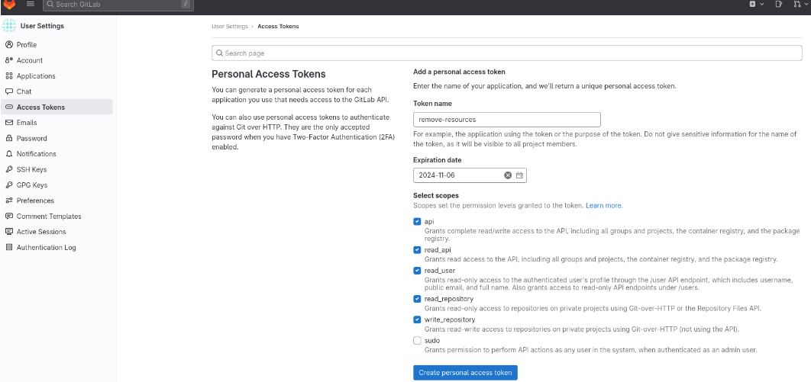
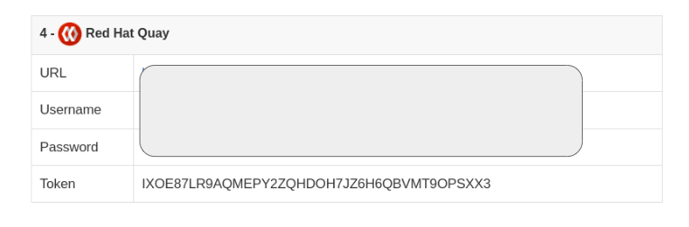
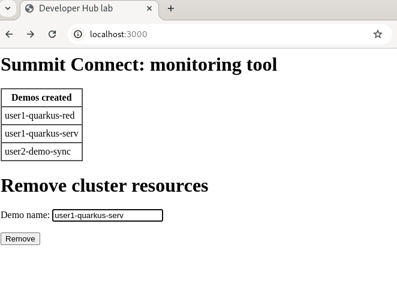

# Remove resources from developer hub demo environment

The aim of this application is keeping the resources of the OpenShift cluster under control, removing the following components created after running the "Quarkus Service with ArgoCD and a Tekton Pipeline" software template:
*   ArgoCd applications ("demo-name"-bootstrap)
*   Namespaces ("demo-name"-dev,"demo-name"-preprod,"demo-name"-prod)
*   Gitlab respositories ("demo-name","demo-name-gitops")
*   Quay images

# Instructions:

## Prerequisites

Make sure you have oc (CLI), Node.js and npm installed.

## Install dependencies:

Install the node.js dependencies by running:


```console
npm install express body-parser axios
```

## Configure tokens and URLS

Edit app.js and replace gitlab and quay tokens and URLs:

```console
  178  const gitlabApiUrl = 'https://XXXXXXXXXXXXX/api/v4'; // Replace by GItlab API URL
  180  const gitlabToken = 'YYYYYYYYYYYYYYYYYYYY'; // Replace by Gitlab token
    ....
  229 const quayApiUrl = 'https://XXXXXXXXXXXXXXXXXXXXXXXXXXXXXXX/api/v1'; // Replace by Quay API URL  
  230 const quayToken = 'YYYYYYYYYYYYYYYYYYYYYYYYYYYYY'; // Reeplace by Quay token
```

Find some examples about how to get your tokens as follows:

*   GITLAB




*   QUAY




## Sign in your OpenShift cluster

ex. oc login.....

## Run application:

```console
node app.js
```


Open your browser and visit http://localhost:3000/. Add demo name and click on "Remove" button.




Note: Deleting resources is a destructive operation. Please ensure you fully understand the impact and have the necessary backups before running this code in a live environment.

